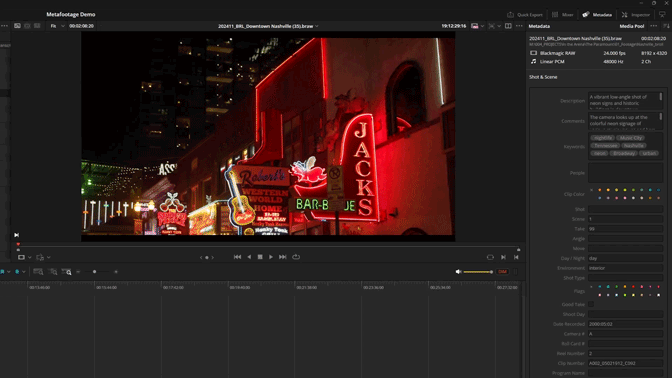

# Metafootage – AI-Powered Metadata for DaVinci Resolve

Metafootage is a lightweight **DaVinci Resolve scripting plugin** that uses **Google’s Gemini Vision API**  or **OpenAI*to analyze video clips and automatically generate rich, cinematic metadata.

It turns unlogged clips into **searchable, organized assets** by writing AI-generated descriptions and keywords directly into Resolve’s metadata fields.

This project is focused on **editorial workflow speed and organization**, not on building a commercial product.
 
---
## Automatic Metadata Generation



---

## Why I Made This

I built Metafootage while working on long-form documentary projects.

Manual logging does not scale. When you’re dealing with dozens or hundreds of clips, writing descriptions and keywords by hand quickly becomes a bottleneck and pulls focus away from the edit itself.

Metafootage automates that step so you can spend time **thinking about the story**, not labeling files.

---

## Key Capabilities

### Cinematic analysis

Extracts representative frames from each clip and generates detailed descriptions covering lighting, camera movement, subject action, emotion, and setting.

### Smart metadata merging

Preserves any existing keywords or notes on your clips and appends new AI-generated metadata instead of overwriting your work.

### Model selection

Supports faster, lower-cost analysis for b-roll and dailies, as well as higher-quality reasoning for hero shots and complex scenes.

### Proxy-aware

Detects common raw formats such as **BRAW**, **R3D**, and **ARRIRAW**, and analyzes proxies when available so the AI sees a properly graded image instead of flat log footage.

### Privacy-conscious

Frames are sent directly to the Gemini API for analysis. No footage is stored or retained by Metafootage beyond the API request.

---

## What’s Included

This package is intentionally minimal.

* **`Metafootage.py`**
  The DaVinci Resolve script. This is the only file Resolve needs.

* **`README.md`**
  Installation and usage instructions.

* **`LICENSE`**
  MIT License.

---

## Requirements

* **DaVinci Resolve** (Studio or Free)
* **Python 3.6+** (used by Resolve scripting)
* **FFmpeg** (used to extract frames from clips)
* **Google Gemini API key**

---

## Installing FFmpeg

### Windows

```bash
winget install ffmpeg
```

### macOS

```bash
brew install ffmpeg
```

### Linux

Install via your system package manager (for example):

```bash
apt install ffmpeg
```

---

## Installation (DaVinci Resolve)

1. Copy **`Metafootage.py`** to your Resolve Scripts folder:

   **Windows**

   ```
   %APPDATA%\Blackmagic Design\DaVinci Resolve\Support\Fusion\Scripts\Edit\
   ```

   **macOS**

   ```
   ~/Library/Application Support/Blackmagic Design/DaVinci Resolve/Fusion/Scripts/Edit/
   ```

   **Linux**

   ```
   /opt/resolve/Fusion/Scripts/Edit/
   ```

2. Restart **DaVinci Resolve**.

3. Select one or more clips in the **Media Pool**.

4. Run the script from:
   **Workspace → Scripts → Metafootage**

5. On first run, you will be prompted to enter your **Gemini API key**.
   The key is stored locally on your machine.

---

## How It Works

1. Metafootage extracts a small number of representative frames from each selected clip.
2. Frames are sent to the Gemini Vision API for analysis.
3. The AI returns structured descriptions and keywords.
4. Metadata is written directly into Resolve’s clip metadata fields.
5. Existing metadata is preserved and augmented—not overwritten.

Once processed, clips become instantly searchable using Resolve’s metadata filters.

---

## Contributing

This is a personal side project, but contributions are welcome.

If you find a bug or have an idea for improvement, feel free to open an issue.
Pull requests are encouraged—please keep them focused and well-scoped.

---

## License

Released under the **MIT License**.
See the `LICENSE` file for details.

---

## Author

Created by **Wayne Degan**

