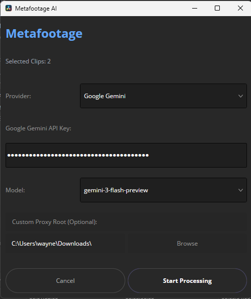
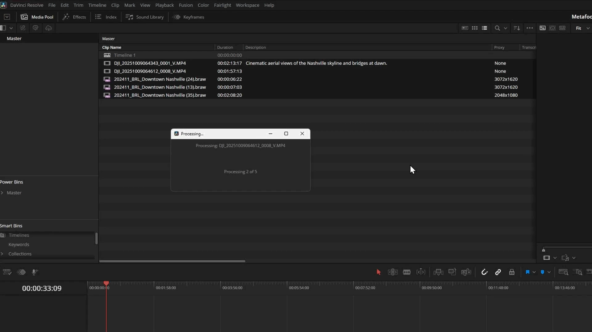

# Metafootage  
**AI-powered metadata generation for DaVinci Resolve**

Metafootage is a lightweight DaVinci Resolve script that analyzes video clips using **Google Gemini** or **OpenAI** and automatically generates rich, editorially useful metadata.



---

## What Metafootage does

Select clips in the Media Pool → run Metafootage → it:

- extracts representative frames from each clip  
- sends those frames to your chosen AI model  
- generates cinematic descriptions (action, setting, lighting, camera feel)  
- writes results directly into Resolve’s metadata fields  
- merges with existing keywords instead of overwriting them  



---

## Key features

### Cinematic descriptions  
Descriptions are written for editors. focused on what’s happening in the shot and how it looks and feels during a real cut.

### Adjustable frame sampling  
Choose how many frames per clip are analyzed (3, 5, or 7) to balance speed, cost, and descriptive depth.

### Smart keyword handling  
Existing keywords are preserved and merged, so prior organization is never lost.

### Model selection  
Use a faster model for bulk logging or a higher-quality model for important or hero moments.

### RAW-friendly via proxies  
Some camera RAW formats (BRAW, R3D, ARRIRAW) can’t be reliably decoded by FFmpeg.  
Metafootage supports this by analyzing **Resolve proxy or optimized media** instead.

### Local-first  
All processing runs from your machine. Media is not stored by Metafootage beyond what’s required to send a request to your AI provider.

---

## API Keys & Privacy

Metafootage supports multiple ways to provide API keys. Nothing is sent unless you explicitly run analysis.

### Supported methods (priority order)

1. **Environment variables (recommended)**
   - OpenAI: `OPENAI_API_KEY`
   - Gemini: `GEMINI_API_KEY` or `GOOGLE_API_KEY`

2. **Session-only keys**
   - Paste a key for the current session without saving it to disk.

3. **Saved keys (optional)**
   - Keys can be stored locally only if explicitly enabled.

If an environment variable is present, the API key field can be left blank.  
The UI will indicate which source is being used (env var, session, or saved).

### What gets sent to the API

- A small set of representative frames per clip (3 / 5 / 7)
- No full video files
- No audio
- No timelines or project data

Keys are never logged or printed.  
If you prefer maximum isolation, use environment variables or session-only keys.

----

## Requirements

- **DaVinci Resolve** (Studio or Free)  
- **Python** (used by Resolve scripting)  
- **FFmpeg** (used to extract frames)  
- **Google Gemini API key or OpenAI API key**

---

## Installing FFmpeg

**Windows**
```bash
winget install ffmpeg
```

**macOS**
```bash
brew install ffmpeg
```

**Linux**
```bash
sudo apt install ffmpeg
```

---

## Installation (DaVinci Resolve)

Metafootage is distributed as **a single script file**.

1. Copy `Metafootage.py` to your Resolve Scripts folder:

   **Windows**
   ```
   %APPDATA%\Blackmagic Design\DaVinci Resolve\Support\Fusion\Scripts\Edit\
   ```

   **macOS**
   ```
   ~/Library/Application Support/Blackmagic Design/DaVinci Resolve/Fusion/Scripts/Edit/
   ```

   **Linux**
   ```
   /opt/resolve/Fusion/Scripts/Edit/
   ```

2. Restart **DaVinci Resolve**.

3. Select one or more clips in the **Media Pool**.

4. Run  
   **Workspace → Scripts → Metafootage**

5. On first run, enter your **Gemini or OpenAI API key**.

---

## API key storage

API keys are stored **locally on your machine** in a small config file.  
They are base64-encoded for light obfuscation (not encryption).

Metafootage does **not** transmit or store API keys anywhere else.

---

## Repository contents

- **Metafootage.py**  
  The Resolve script. This is the only file required to run Metafootage.

- **README.md**  
  Formatted documentation for GitHub.

- **README.txt**  
  Plain-text documentation for packaged distribution.

- **LICENSE**  
  MIT License.

---

## Contributing

If this tool saved you time, contributions or donations are welcome, but not expected.

---

## License

Released under the **MIT License**.  
See the `LICENSE` file for details.

---

## Author

Created by **Wayne Degan**
